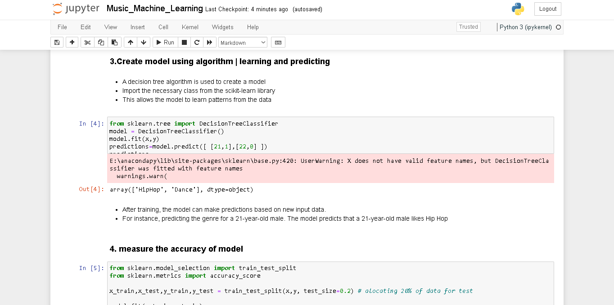
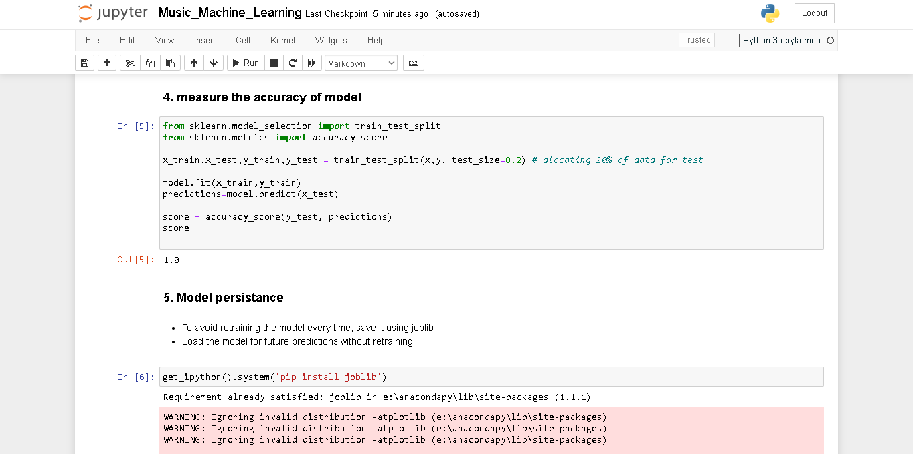

# Music Recommendation Machine Learning Project

- The project involves recommending music albums based on user profiles (age and gender). 
- The model will learn patterns from existing user data to make predictions for new users
## Key Steps
## 1. import data

`import pandas as pd`
`music_data= pd.read_csv('music.csv')`

## 2. CLean or prepare data
`music_data.head(2)`
- Creating Input and Output Sets
  `x=music_data.drop(columns=['genre'])`
  `y=music_data['genre']`

## 3. Building model using algorithm or learning and predicting
- A decision tree algorithm is used to create a model 
- Import the necessary class from the scikit-learn library
- This allows the model to learn patterns from the data

## 4. Measure the accuracy of model
## 5. Model persistance

* To avoid retraining the model every time, save it using joblib
* Load the model for future predictions without retraining
  
## 6. Visualize decision tree
`from sklearn import tree`

`tree.export_graphviz(model, out_file='music-recommender.dot',`
    ` feature_names=['age','gender'],`
    `class_names=sorted(y.unique()),`
     `label='all',`
     ` rounded=True,`
     `filled=True)`
