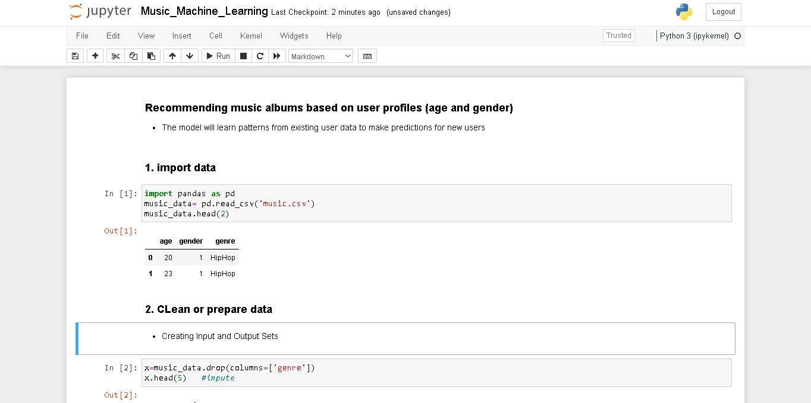

# Music Recommendation Machine Learning Project

- The project involves recommending music albums based on user profiles (age and gender). 
- The model will learn patterns from existing user data to make predictions for new users
## Key Steps
## 1. import data
`import pandas as pd`
`music_data= pd.read_csv('music.csv')`

## 2. CLean or prepare data
`music_data.head(2)`
## 3. Building model using algorithm or learning and predicting
## 4. Measure the accuracy of model
## 5. Model persistance
## 6. Visualize decision tree

